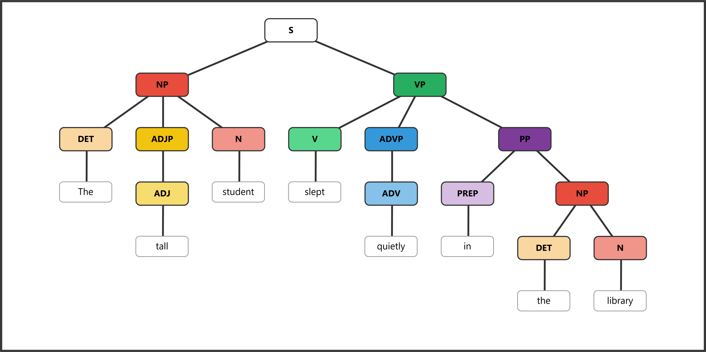
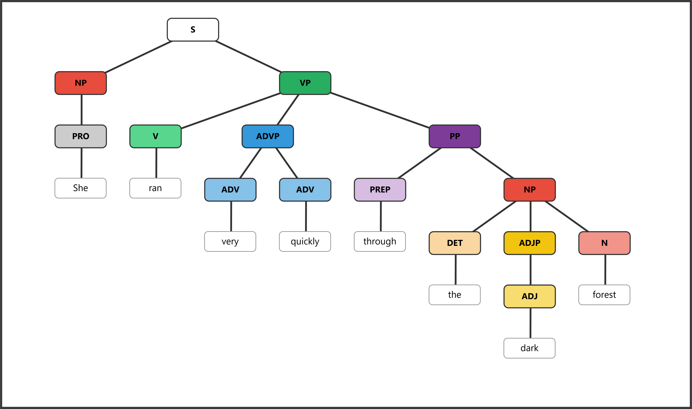
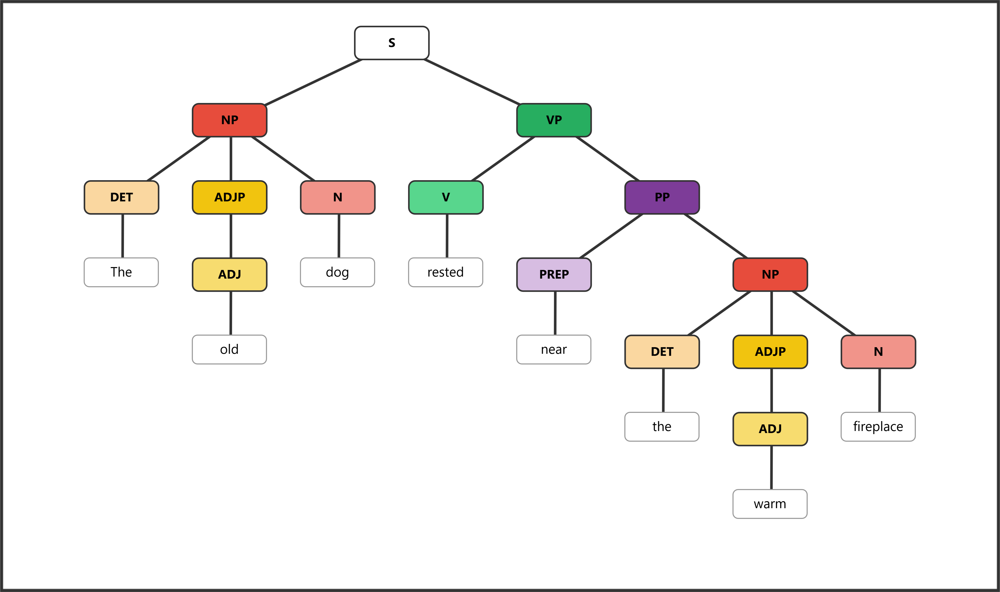
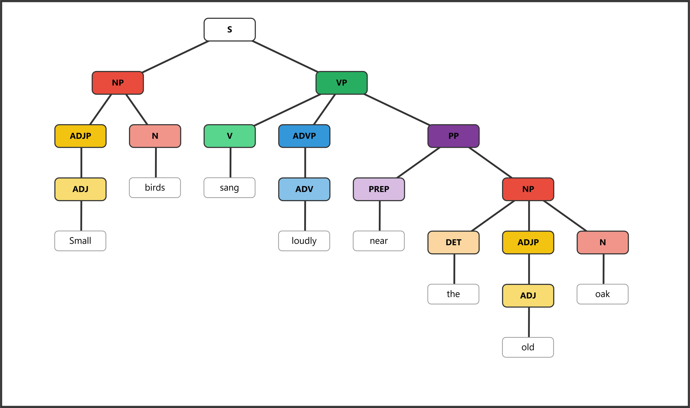

# ENGL 3110 — Bonus Assignment — Spring 2026 — ANSWER KEY

**Total Points: 20 · 2 points per sentence**

---

## Sentence 1: The tall student slept quietly in the library.

| Role   | Subject |  |  | Predicate |  |  |  |  |
|--------|---------|--|--|-----------|--|--|--|--|
| Phrase | NP      |  |  | VP        | ADVP | PP |  |  |
| Word   | The | tall | student | slept | quietly | in | the | library |
| POS    | DET | ADJ | N | V | ADV | PREP | DET | N |

**Bracket notation:**
```
[S [NP [DET The] [ADJP [ADJ tall]] [N student]] [VP [V slept] [ADVP [ADV quietly]] [PP [PREP in] [NP [DET the] [N library]]]]]
```

**Diagram:** 

---

## Sentence 2: The young children played happily in the yard.

| Role   | Subject |  |  | Predicate |  |  |  |  |
|--------|---------|--|--|-----------|--|--|--|--|
| Phrase | NP      |  |  | VP        | ADVP | PP |  |  |
| Word   | The | young | children | played | happily | in | the | yard |
| POS    | DET | ADJ | N | V | ADV | PREP | DET | N |

**Bracket notation:**
```
[S [NP [DET The] [ADJP [ADJ young]] [N children]] [VP [V played] [ADVP [ADV happily]] [PP [PREP in] [NP [DET the] [N yard]]]]]
```

**Diagram:** 

---

## Sentence 3: She ran very quickly through the dark forest.

| Role   | Subject | Predicate |  |  |  |  |  |  |
|--------|---------|-----------|--|--|--|--|--|--|
| Phrase | NP      | VP        | ADVP |  | PP |  |  |  |
| Word   | She | ran | very | quickly | through | the | dark | forest |
| POS    | PRO | V | ADV | ADV | PREP | DET | ADJ | N |

**Bracket notation:**
```
[S [NP [PRO She]] [VP [V ran] [ADVP [ADV very] [ADV quickly]] [PP [PREP through] [NP [DET the] [ADJP [ADJ dark]] [N forest]]]]]
```

**Diagram:** 

---

## Sentence 4: The old dog rested near the warm fireplace.

| Role   | Subject |  |  | Predicate |  |  |  |  |
|--------|---------|--|--|-----------|--|--|--|--|
| Phrase | NP      |  |  | VP        | PP |  |  |  |
| Word   | The | old | dog | rested | near | the | warm | fireplace |
| POS    | DET | ADJ | N | V | PREP | DET | ADJ | N |

**Bracket notation:**
```
[S [NP [DET The] [ADJP [ADJ old]] [N dog]] [VP [V rested] [PP [PREP near] [NP [DET the] [ADJP [ADJ warm]] [N fireplace]]]]]
```

**Diagram:** 

---

## Sentence 5: The bright stars shone above the quiet town.

| Role   | Subject |  |  | Predicate |  |  |  |  |
|--------|---------|--|--|-----------|--|--|--|--|
| Phrase | NP      |  |  | VP        | PP |  |  |  |
| Word   | The | bright | stars | shone | above | the | quiet | town |
| POS    | DET | ADJ | N | V | PREP | DET | ADJ | N |

**Bracket notation:**
```
[S [NP [DET The] [ADJP [ADJ bright]] [N stars]] [VP [V shone] [PP [PREP above] [NP [DET the] [ADJP [ADJ quiet]] [N town]]]]]
```

**Diagram:** 

---

## Sentence 6: They walked very slowly along the narrow path.

| Role   | Subject | Predicate |  |  |  |  |  |  |
|--------|---------|-----------|--|--|--|--|--|--|
| Phrase | NP      | VP        | ADVP |  | PP |  |  |  |
| Word   | They | walked | very | slowly | along | the | narrow | path |
| POS    | PRO | V | ADV | ADV | PREP | DET | ADJ | N |

**Bracket notation:**
```
[S [NP [PRO They]] [VP [V walked] [ADVP [ADV very] [ADV slowly]] [PP [PREP along] [NP [DET the] [ADJP [ADJ narrow]] [N path]]]]]
```

**Diagram:** 

---

## Sentence 7: The nervous professor spoke clearly at the podium.

| Role   | Subject |  |  | Predicate |  |  |  |  |
|--------|---------|--|--|-----------|--|--|--|--|
| Phrase | NP      |  |  | VP        | ADVP | PP |  |  |
| Word   | The | nervous | professor | spoke | clearly | at | the | podium |
| POS    | DET | ADJ | N | V | ADV | PREP | DET | N |

**Bracket notation:**
```
[S [NP [DET The] [ADJP [ADJ nervous]] [N professor]] [VP [V spoke] [ADVP [ADV clearly]] [PP [PREP at] [NP [DET the] [N podium]]]]]
```

**Diagram:** 

---

## Sentence 8: Small birds sang loudly near the old oak.

| Role   | Subject |  | Predicate |  |  |  |  |  |
|--------|---------|--|-----------|--|--|--|--|--|
| Phrase | NP      |  | VP        | ADVP | PP |  |  |  |
| Word   | Small | birds | sang | loudly | near | the | old | oak |
| POS    | ADJ | N | V | ADV | PREP | DET | ADJ | N |

**Bracket notation:**
```
[S [NP [ADJP [ADJ Small]] [N birds]] [VP [V sang] [ADVP [ADV loudly]] [PP [PREP near] [NP [DET the] [ADJP [ADJ old]] [N oak]]]]]
```

**Diagram:** 

---

## Sentence 9: He waited very patiently outside the large building.

| Role   | Subject | Predicate |  |  |  |  |  |  |
|--------|---------|-----------|--|--|--|--|--|--|
| Phrase | NP      | VP        | ADVP |  | PP |  |  |  |
| Word   | He | waited | very | patiently | outside | the | large | building |
| POS    | PRO | V | ADV | ADV | PREP | DET | ADJ | N |

**Bracket notation:**
```
[S [NP [PRO He]] [VP [V waited] [ADVP [ADV very] [ADV patiently]] [PP [PREP outside] [NP [DET the] [ADJP [ADJ large]] [N building]]]]]
```

**Diagram:** 

---

## Sentence 10: The tired runner collapsed suddenly at the barrier.

| Role   | Subject |  |  | Predicate |  |  |  |  |
|--------|---------|--|--|-----------|--|--|--|--|
| Phrase | NP      |  |  | VP        | ADVP | PP |  |  |
| Word   | The | tired | runner | collapsed | suddenly | at | the | barrier |
| POS    | DET | ADJ | N | V | ADV | PREP | DET | N |

**Bracket notation:**
```
[S [NP [DET The] [ADJP [ADJ tired]] [N runner]] [VP [V collapsed] [ADVP [ADV suddenly]] [PP [PREP at] [NP [DET the] [N barrier]]]]]
```

**Diagram:** 
