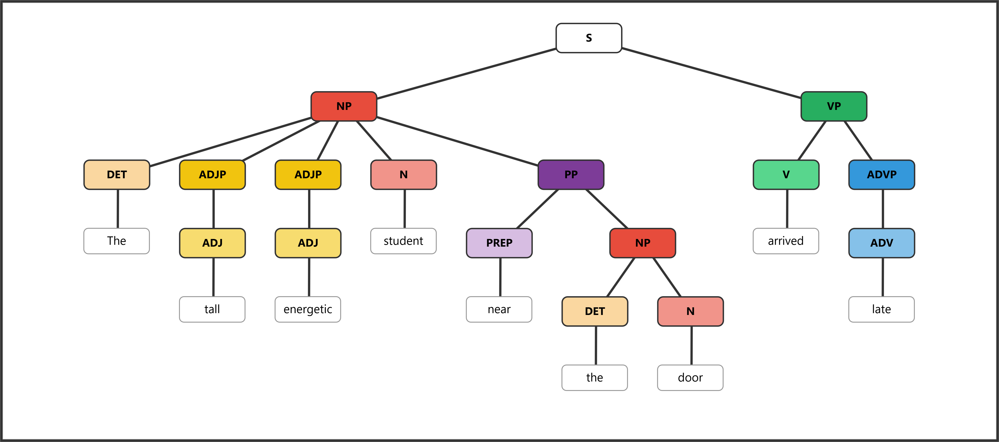
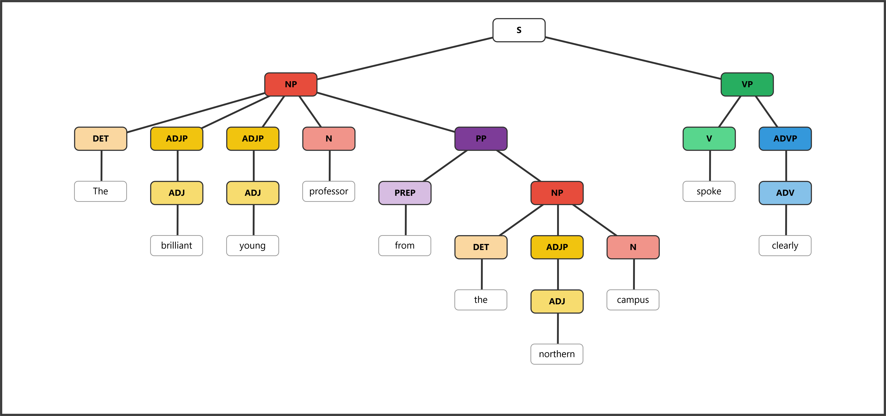
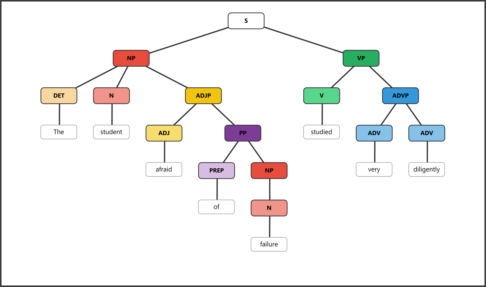
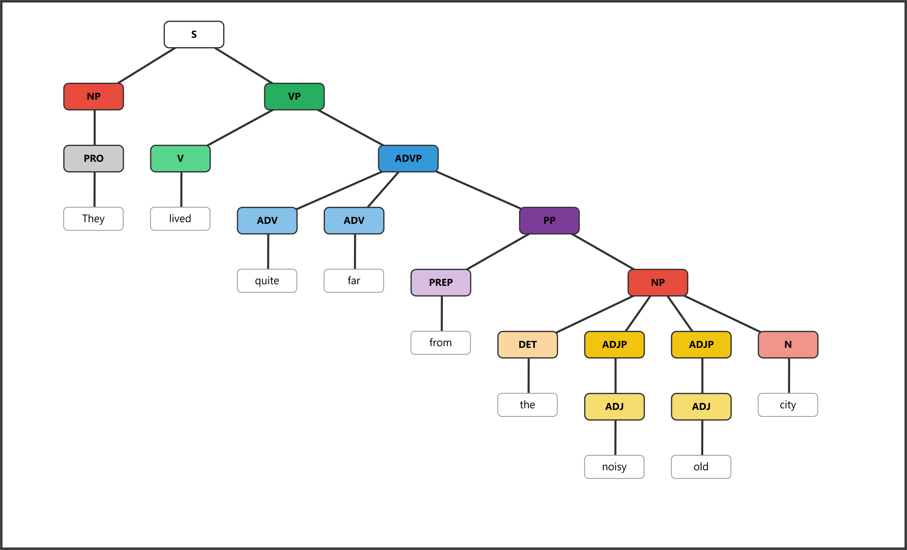
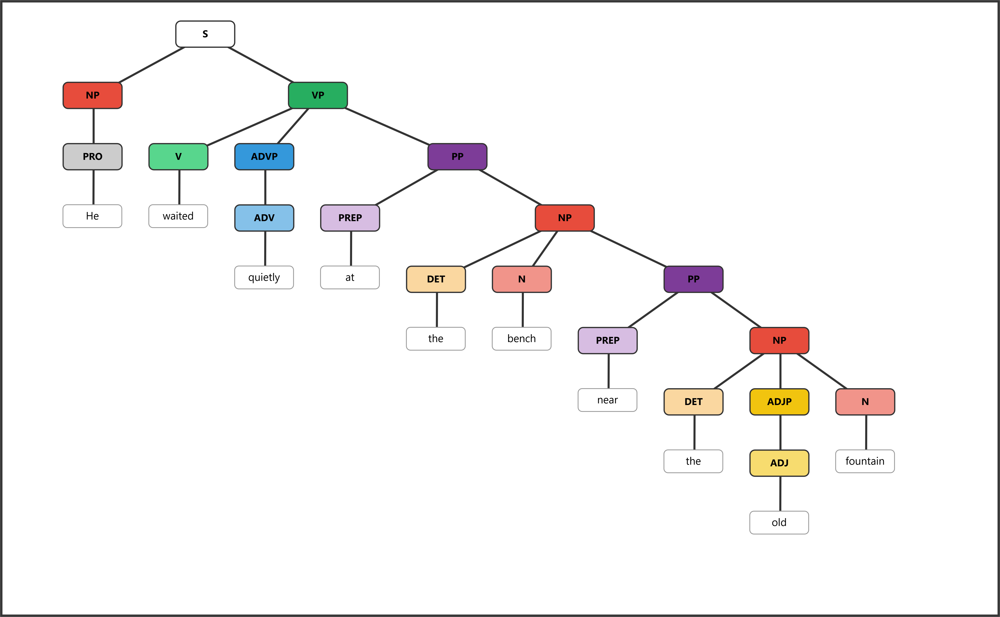
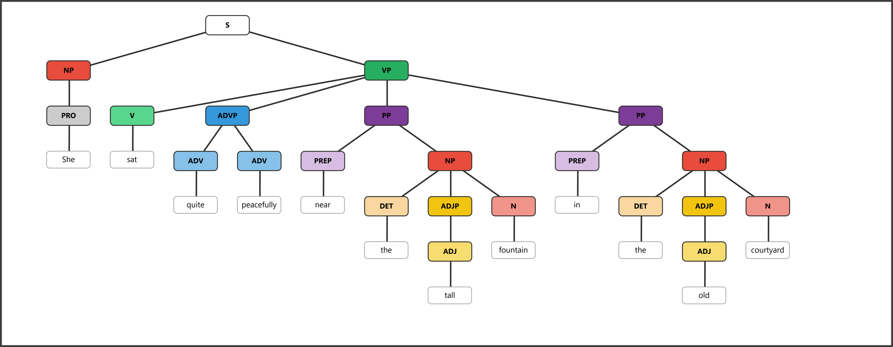
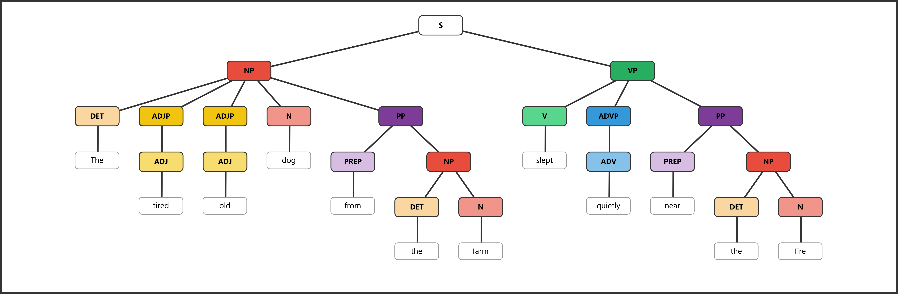
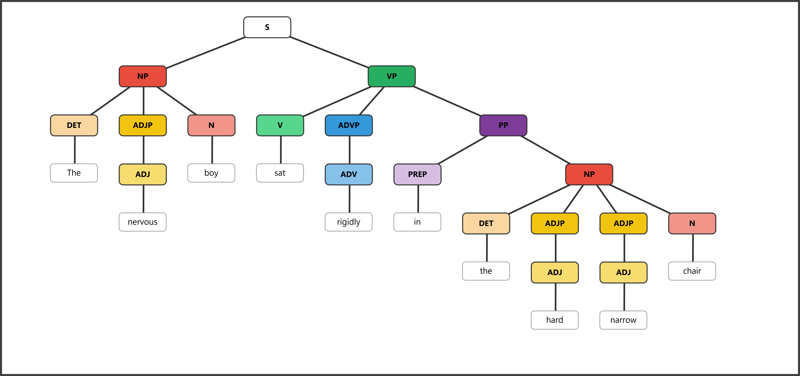
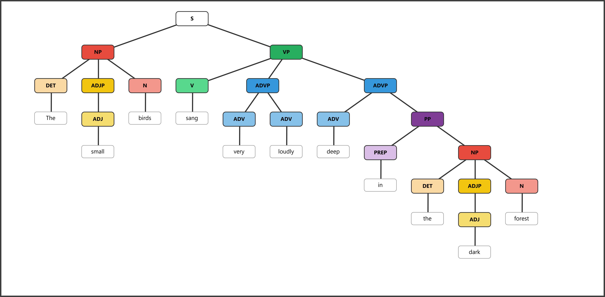
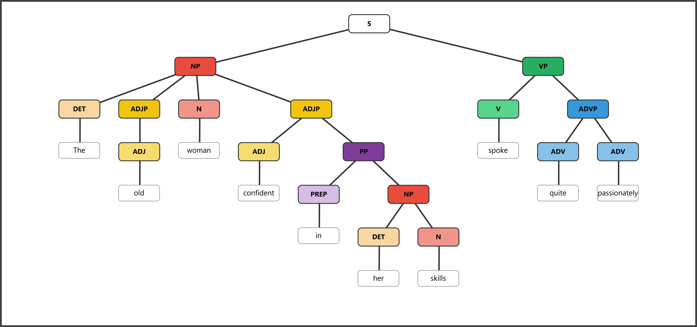

# ENGL 3110 — Bonus Assignment — Spring 2026 — ANSWER KEY

**Total Points: 20  ·  2 points per sentence**

---

## Notes on Table Labeling

- Pre-nominal adjectives are included inside the NP span (no separate ADJP label in the table).
- Post-nominal PP inside an NP: the NP label covers the head noun (and pre-nominal adjectives); the PP is labeled separately.
- Post-nominal ADJP inside an NP: same rule — NP covers the head, ADJP is labeled separately.
- PP inside an ADJP (bracket level): shown in bracket notation only; in the table the ADJP label spans the whole post-nominal group.
- PP inside an ADVP (bracket level): the ADVP label spans the whole adverbial group in the table.

---

## Sentence 1: The tall energetic student near the door arrived late.
*PP → N (subject head); long NP with two pre-nominal ADJs*

| Role   | Subject |  |  |  |  |  |  | Predicate |  |
|--------|---------|--|--|--|--|--|--|-----------|--|
| Phrase | NP      |  |  |  | PP |  |  | VP        | ADVP |
| Word   | The | tall | energetic | student | near | the | door | arrived | late |
| POS    | DET | ADJ | ADJ | N | PREP | DET | N | V | ADV |

**Bracket notation:**
```
[S [NP [DET The] [ADJP [ADJ tall]] [ADJP [ADJ energetic]] [N student] [PP [PREP near] [NP [DET the] [N door]]]] [VP [V arrived] [ADVP [ADV late]]]]
```
**Diagram:** 

---

## Sentence 2: The brilliant young professor from the northern campus spoke clearly.
*PP → N (subject head); very long NP (two pre-nominal ADJs + post-nominal PP with ADJ inside)*

| Role   | Subject |  |  |  |  |  |  |  | Predicate |  |
|--------|---------|--|--|--|--|--|--|--|-----------|--|
| Phrase | NP      |  |  |  | PP |  |  |  | VP        | ADVP |
| Word   | The | brilliant | young | professor | from | the | northern | campus | spoke | clearly |
| POS    | DET | ADJ | ADJ | N | PREP | DET | ADJ | N | V | ADV |

**Bracket notation:**
```
[S [NP [DET The] [ADJP [ADJ brilliant]] [ADJP [ADJ young]] [N professor] [PP [PREP from] [NP [DET the] [ADJP [ADJ northern]] [N campus]]]] [VP [V spoke] [ADVP [ADV clearly]]]]
```
**Diagram:** 

---

## Sentence 3: The student afraid of failure studied very diligently.
*PP → ADJ: the PP "of failure" is a complement of ADJ "afraid" inside the post-nominal ADJP*

| Role   | Subject |  | Predicate |  |  |  |  |  |
|--------|---------|--|-----------|--|--|--|--|--|
| Phrase | NP      |  | ADJP      |  |  | VP | ADVP |  |
| Word   | The | student | afraid | of | failure | studied | very | diligently |
| POS    | DET | N | ADJ | PREP | N | V | ADV | ADV |

**Bracket notation:**
```
[S [NP [DET The] [N student] [ADJP [ADJ afraid] [PP [PREP of] [NP [N failure]]]]] [VP [V studied] [ADVP [ADV very] [ADV diligently]]]]
```
**Diagram:** 

---

## Sentence 4: They lived quite far from the noisy old city.
*PP → ADV: the PP "from the noisy old city" is a complement of ADV "far" inside the ADVP*

| Role   | Subject | Predicate |  |  |  |  |  |  |  |
|--------|---------|-----------|--|--|--|--|--|--|--|
| Phrase | NP      | VP        | ADVP |  |  |  |  |  |  |
| Word   | They | lived | quite | far | from | the | noisy | old | city |
| POS    | PRO | V | ADV | ADV | PREP | DET | ADJ | ADJ | N |

*The ADVP spans "quite far from the noisy old city" — the PP is inside the ADVP, modifying "far."*

**Bracket notation:**
```
[S [NP [PRO They]] [VP [V lived] [ADVP [ADV quite] [ADV far] [PP [PREP from] [NP [DET the] [ADJP [ADJ noisy]] [ADJP [ADJ old]] [N city]]]]]]
```
**Diagram:** 

---

## Sentence 5: He waited quietly at the bench near the old fountain.
*Nested PP: "near the old fountain" modifies the N "bench," which is the object of "at"*

| Role   | Subject | Predicate |  |  |  |  |  |  |  |  |
|--------|---------|-----------|--|--|--|--|--|--|--|--|
| Phrase | NP      | VP        | ADVP | PP |  |  | PP |  |  |  |
| Word   | He | waited | quietly | at | the | bench | near | the | old | fountain |
| POS    | PRO | V | ADV | PREP | DET | N | PREP | DET | ADJ | N |

*PP₁ (cols 4–6) = outer PP headed by "at." PP₂ (cols 7–10) = inner PP modifying the noun "bench" inside PP₁'s NP object.*

**Bracket notation:**
```
[S [NP [PRO He]] [VP [V waited] [ADVP [ADV quietly]] [PP [PREP at] [NP [DET the] [N bench] [PP [PREP near] [NP [DET the] [ADJP [ADJ old]] [N fountain]]]]]]]
```
**Diagram:** 

---

## Sentence 6: She sat quite peacefully near the tall fountain in the old courtyard.
*Very long VP: V + ADVP + PP + PP (two adverbial PPs)*

| Role   | Subject | Predicate |  |  |  |  |  |  |  |  |  |  |
|--------|---------|-----------|--|--|--|--|--|--|--|--|--|--|
| Phrase | NP      | VP        | ADVP |  | PP |  |  |  | PP |  |  |  |
| Word   | She | sat | quite | peacefully | near | the | tall | fountain | in | the | old | courtyard |
| POS    | PRO | V | ADV | ADV | PREP | DET | ADJ | N | PREP | DET | ADJ | N |

**Bracket notation:**
```
[S [NP [PRO She]] [VP [V sat] [ADVP [ADV quite] [ADV peacefully]] [PP [PREP near] [NP [DET the] [ADJP [ADJ tall]] [N fountain]]] [PP [PREP in] [NP [DET the] [ADJP [ADJ old]] [N courtyard]]]]]
```
**Diagram:** 

---

## Sentence 7: The tired old dog from the farm slept quietly near the fire.
*Long NP (DET+ADJ+ADJ+N+PP) AND long VP (V+ADVP+PP); PP→N(subj) and PP→V both present*

| Role   | Subject |  |  |  |  |  |  | Predicate |  |  |  |  |
|--------|---------|--|--|--|--|--|--|-----------|--|--|--|--|
| Phrase | NP      |  |  |  | PP |  |  | VP        | ADVP | PP |  |  |
| Word   | The | tired | old | dog | from | the | farm | slept | quietly | near | the | fire |
| POS    | DET | ADJ | ADJ | N | PREP | DET | N | V | ADV | PREP | DET | N |

**Bracket notation:**
```
[S [NP [DET The] [ADJP [ADJ tired]] [ADJP [ADJ old]] [N dog] [PP [PREP from] [NP [DET the] [N farm]]]] [VP [V slept] [ADVP [ADV quietly]] [PP [PREP near] [NP [DET the] [N fire]]]]]
```
**Diagram:** 

---

## Sentence 8: The nervous boy sat rigidly in the hard narrow chair.
*PP → V (adverbial); PP's NP object contains two pre-nominal ADJs*

| Role   | Subject |  |  | Predicate |  |  |  |  |  |  |
|--------|---------|--|--|-----------|--|--|--|--|--|--|
| Phrase | NP      |  |  | VP        | ADVP | PP |  |  |  |  |
| Word   | The | nervous | boy | sat | rigidly | in | the | hard | narrow | chair |
| POS    | DET | ADJ | N | V | ADV | PREP | DET | ADJ | ADJ | N |

**Bracket notation:**
```
[S [NP [DET The] [ADJP [ADJ nervous]] [N boy]] [VP [V sat] [ADVP [ADV rigidly]] [PP [PREP in] [NP [DET the] [ADJP [ADJ hard]] [ADJP [ADJ narrow]] [N chair]]]]]
```
**Diagram:** 

---

## Sentence 9: The small birds sang very loudly deep in the dark forest.
*PP → ADV: "deep" is modified by "in the dark forest" inside the second ADVP*

| Role   | Subject |  |  | Predicate |  |  |  |  |  |  |  |
|--------|---------|--|--|-----------|--|--|--|--|--|--|--|
| Phrase | NP      |  |  | VP        | ADVP |  | ADVP |  |  |  |  |
| Word   | The | small | birds | sang | very | loudly | deep | in | the | dark | forest |
| POS    | DET | ADJ | N | V | ADV | ADV | ADV | PREP | DET | ADJ | N |

*ADVP₁ (cols 5–6) = "very loudly." ADVP₂ (cols 7–11) = "deep in the dark forest" — the PP is inside ADVP₂, modifying ADV "deep."*

**Bracket notation:**
```
[S [NP [DET The] [ADJP [ADJ small]] [N birds]] [VP [V sang] [ADVP [ADV very] [ADV loudly]] [ADVP [ADV deep] [PP [PREP in] [NP [DET the] [ADJP [ADJ dark]] [N forest]]]]]]
```
**Diagram:** 

---

## Sentence 10: The old woman confident in her skills spoke quite passionately.
*PP → ADJ: "in her skills" is a complement of ADJ "confident" inside the post-nominal ADJP*

| Role   | Subject |  |  |  |  |  |  | Predicate |  |  |
|--------|---------|--|--|--|--|--|--|-----------|--|--|
| Phrase | NP      |  |  | ADJP |  |  |  | VP        | ADVP |  |
| Word   | The | old | woman | confident | in | her | skills | spoke | quite | passionately |
| POS    | DET | ADJ | N | ADJ | PREP | DET | N | V | ADV | ADV |

*NP spans "The old woman" (DET+ADJ+N). ADJP spans "confident in her skills" (post-nominal modifier; the PP is inside the ADJP in the tree).*

**Bracket notation:**
```
[S [NP [DET The] [ADJP [ADJ old]] [N woman] [ADJP [ADJ confident] [PP [PREP in] [NP [DET her] [N skills]]]]] [VP [V spoke] [ADVP [ADV quite] [ADV passionately]]]]
```
**Diagram:** 
