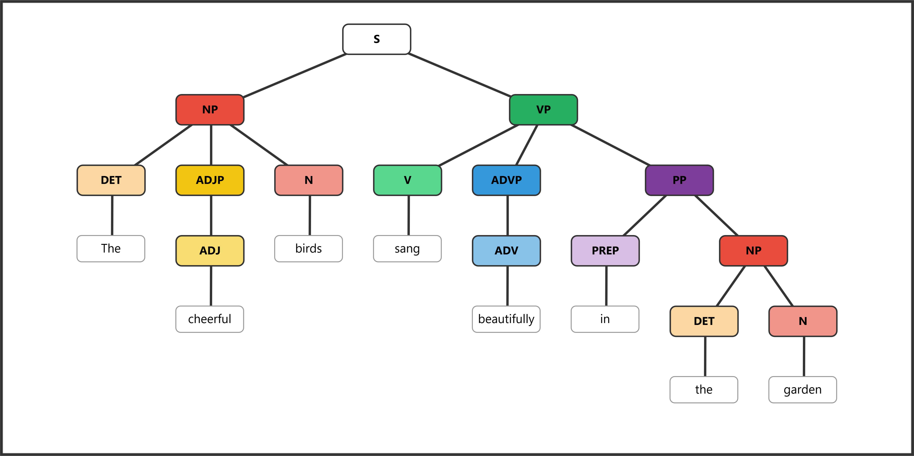
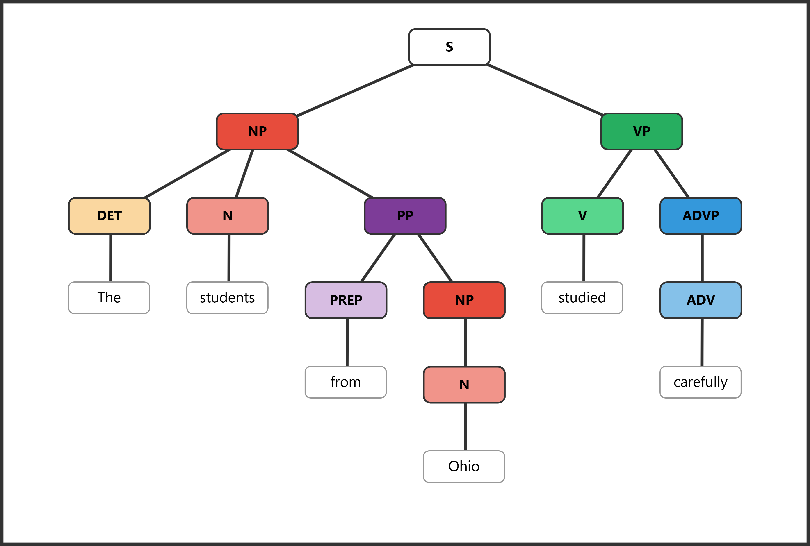
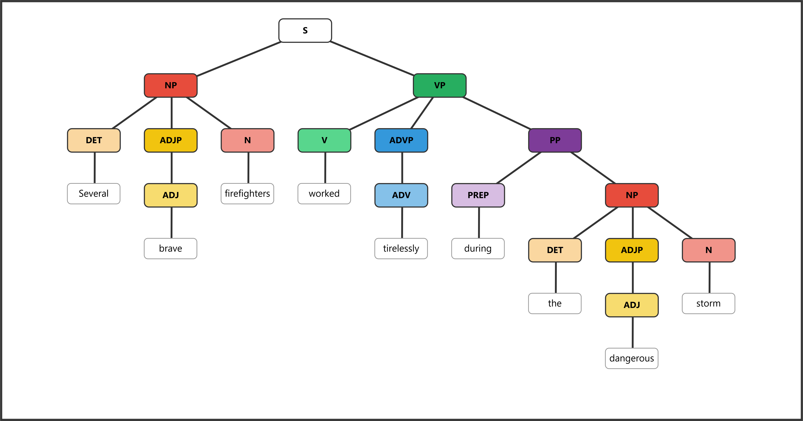
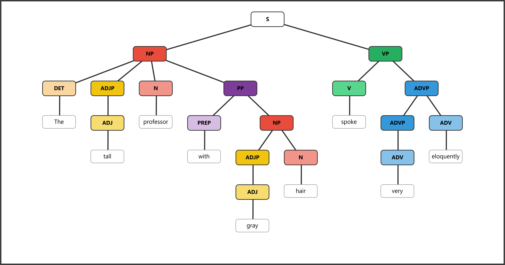

# ENGL 3110 - Exam One - Spring 2026 — ANSWER KEY

**Total Points: 100 - Time: 70 Minutes**

**Resources:** Anything except help from other people or AI/LLM (ChatGPT, etc.)

**Sections:**

- **Section A: Multiple Choice** — 50 points (25 questions, 2 points each) — Suggested Time: 30 minutes
- **Section B: Sentence Labeling and Diagramming** — 50 points (5 sentences, 10 points each) — Suggested Time: 30 minutes
- **Bonus** — 10 points (5 questions, 2 points each)

---

## Section A: Multiple Choice (50 points)

### Section A1: Morphology and Word Structure (Questions 1–8, 16 points)

**Question 1:** How many morphemes does the word "disagreements" contain? (2 pts)

> **Answer: d**
>
> a. 1
>
> b. 2
>
> c. 3
>
> **d. 4** — *dis-* (bound) + *agree* (free) + *-ment* (bound) + *-s* (bound)

**Question 2:** Which of the following words contains exactly one morpheme? (2 pts)

> **Answer: b**
>
> a. unfriendly — 3 morphemes: *un-* + *friend* + *-ly*
>
> **b. describe** — 1 morpheme. Although it appears to begin with *de-*, the remaining *-scribe* does not combine with *de-* to produce the word's meaning compositionally. The word entered English as a unit.
>
> c. replayable — 3 morphemes: *re-* + *play* + *-able*
>
> d. misplace — 2 morphemes: *mis-* + *place*

**Question 3:** Which of the following is a bound morpheme? (2 pts)

> **Answer: c**
>
> a. book — free morpheme (can stand alone)
>
> b. happy — free morpheme (can stand alone)
>
> **c. -ness** — bound morpheme (cannot stand alone; must attach to another morpheme)
>
> d. walk — free morpheme (can stand alone)

**Question 4:** The suffix *-tion* typically creates which word class? (2 pts)

> **Answer: c**
>
> a. Verb
>
> b. Adjective
>
> **c. Noun** — *-tion* converts verbs into nouns: *action*, *creation*, *decision*
>
> d. Adverb

**Question 5:** Which word is an example of a compound (formed from two free morphemes)? (2 pts)

> **Answer: c**
>
> a. understand — 1 morpheme. The meaning of "understand" does not derive from "under" + "stand."
>
> b. carpet — 1 morpheme. "Car" + "pet" is coincidental resemblance, not a compound.
>
> **c. bookcase** — 2 free morphemes: *book* + *case*. The meaning is compositional (a case for books).
>
> d. receive — 1 morpheme. "Ceive" is not a word in modern English.

**Question 6:** The word "unhelpful" contains how many morphemes? (2 pts)

> **Answer: c**
>
> a. 1
>
> b. 2
>
> **c. 3** — *un-* (bound) + *help* (free) + *-ful* (bound)
>
> d. 4

**Question 7:** Which of the following correctly identifies the morphemes in "rebuilding"? (2 pts)

> **Answer: a**
>
> **a. *re-* (bound) + *build* (free) + *-ing* (bound)** — Correct. *Re-* is a bound prefix meaning "again," *build* is the free base, and *-ing* is a bound suffix.
>
> b. *re-* (free) + *build* (free) + *-ing* (bound) — Incorrect. *Re-* is bound, not free.
>
> c. *rebuild* (free) + *-ing* (bound) — Incorrect. *Rebuild* can be further divided into *re-* + *build*.
>
> d. *re-* (bound) + *building* (free) — Incorrect. *Building* should be divided into *build* + *-ing*.

**Question 8:** Which word best demonstrates the concept of morphological productivity — the active use of existing morpheme patterns to create new words? (2 pts)

> **Answer: b**
>
> a. receive — Borrowed as a whole word from Latin, not productively formed in English.
>
> **b. podcaster** — A recent creation using the productive *-er* suffix (meaning "one who") added to *podcast*. Demonstrates the same pattern as *teacher* and *writer*.
>
> c. understand — A single morpheme; no productive morphological process visible.
>
> d. carpet — A single morpheme; no productive morphological process visible.

---

### Section A2: Open and Closed Classes (Questions 9–16, 16 points)

**Question 9:** Which of the following word classes is an open class? (2 pts)

> **Answer: c**
>
> a. Determiners — closed class
>
> b. Pronouns — closed class
>
> **c. Adjectives** — open class (readily accepts new members: *viral*, *binge-worthy*, *gluten-free*)
>
> d. Prepositions — closed class

**Question 10:** Which feature best distinguishes determiners from adjectives? (2 pts)

> **Answer: c**
>
> a. Determiners appear after the noun — Incorrect. Determiners appear before the noun.
>
> b. Determiners can be modified by "very" — Incorrect. Adjectives can be modified by "very"; determiners cannot.
>
> **c. Determiners must appear before any adjectives in a noun phrase** — Correct. The fixed order is DET + ADJ + N (e.g., *the tall man*, not *tall the man*).
>
> d. Determiners describe qualities of the noun — Incorrect. Adjectives describe qualities; determiners specify reference.

**Question 11:** In the phrase "the tall student from Ohio," which word is the head of the noun phrase? (2 pts)

> **Answer: c**
>
> a. the — determiner (modifier)
>
> b. tall — adjective (modifier)
>
> **c. student** — The head noun. It is the essential word that cannot be removed without destroying the phrase.
>
> d. Ohio — head of a nested NP inside the PP, but not the head of the main NP.

**Question 12:** Which of the following words is a determiner? (2 pts)

> **Answer: c**
>
> a. beautiful — adjective (can be modified by "very": *very beautiful*)
>
> b. quickly — adverb
>
> **c. every** — determiner (appears before adjectives in a noun phrase: *every tall student*; cannot be modified by "very")
>
> d. student — noun

**Question 13:** In the sentence "The professor entered the room and placed her notes on the desk," what is the antecedent of "her"? (2 pts)

> **Answer: b**
>
> a. The room
>
> **b. The professor** — The pronoun "her" (third person, singular, feminine) refers back to "The professor."
>
> c. The desk
>
> d. her notes

**Question 14:** Pronouns replace which of the following elements? (2 pts)

> **Answer: b**
>
> a. Only the head noun — Incorrect.
>
> **b. The entire noun phrase** — Correct. Pronouns replace the full NP including all modifiers: "the tall student from Ohio" → "she."
>
> c. Only the determiner and noun — Incorrect.
>
> d. The verb phrase — Incorrect. Pronouns replace NPs, not VPs.

**Question 15:** Which of the following words is a preposition? (2 pts)

> **Answer: c**
>
> a. quickly — adverb
>
> b. beautiful — adjective
>
> **c. through** — preposition
>
> d. they — pronoun

**Question 16:** Which of the following is NOT a determiner? (2 pts)

> **Answer: c**
>
> a. the — determiner
>
> b. every — determiner
>
> **c. very** — adverb (modifies adjectives and adverbs, not nouns; does not introduce a noun phrase)
>
> d. some — determiner

---

### Section A3: Parts of Speech in Context (Questions 17–25, 18 points)

*Sentence for Questions 17–18: "Several enthusiastic students quietly studied the challenging material."*

**Question 17:** Which word in the sentence above is a determiner? (2 pts)

> **Answer: b**
>
> a. enthusiastic — adjective
>
> **b. Several** — determiner (indicates amount; cannot be modified by "very"; appears before adjectives)
>
> c. quietly — adverb
>
> d. challenging — adjective

**Question 18:** Which word in the sentence above is an adverb? (2 pts)

> **Answer: c**
>
> a. Several — determiner
>
> b. enthusiastic — adjective
>
> **c. quietly** — adverb (modifies the verb "studied"; formed with *-ly* from the adjective *quiet*)
>
> d. material — noun

**Question 19:** In the sentence "The professor with the briefcase lectured brilliantly," what part of speech is "with"? (2 pts)

> **Answer: c**
>
> a. Conjunction
>
> b. Determiner
>
> **c. Preposition** — "With" introduces the prepositional phrase "with the briefcase."
>
> d. Adverb

**Question 20:** In the sentence "My sister carefully examined their proposal," which word is functioning as a verb? (2 pts)

> **Answer: d**
>
> a. My — determiner
>
> b. sister — noun
>
> c. carefully — adverb
>
> **d. examined** — verb (the main action of the sentence; takes past tense *-ed*)

**Question 21:** In the sentence "Three playful kittens explored the mysterious basement," which word is an adjective? (2 pts)

> **Answer: b**
>
> a. Three — determiner
>
> **b. playful** — adjective (describes a quality of "kittens"; can be modified by "very": *very playful*; formed with the adjective-forming suffix *-ful*)
>
> c. explored — verb
>
> d. basement — noun

**Question 22:** In the sentence "She quickly ran to the store," what type of phrase is "to the store"? (2 pts)

> **Answer: d**
>
> a. Noun phrase
>
> b. Verb phrase
>
> c. Adjective phrase
>
> **d. Prepositional phrase** — Headed by the preposition "to," with "the store" as its NP object.

**Question 23:** In the phrase "the extremely tall building," what word class does "extremely" belong to? (2 pts)

> **Answer: b**
>
> a. Adjective
>
> **b. Adverb** — "Extremely" modifies the adjective "tall," telling us the degree of tallness. Adverbs can modify adjectives.
>
> c. Determiner
>
> d. Noun

**Question 24:** Which test reliably distinguishes adjectives from determiners? (2 pts)

> **Answer: b**
>
> a. Adjectives can be pluralized — Incorrect. Nouns are pluralized, not adjectives.
>
> **b. Adjectives can be modified by "very"** — Correct. You can say "very tall" but not "very the" or "very my." This gradability test reliably identifies adjectives.
>
> c. Adjectives always appear after the noun — Incorrect. Adjectives typically appear before the noun in English (attributive position).
>
> d. Adjectives cannot appear before nouns — Incorrect. Adjectives routinely appear before nouns (*the tall man*).

**Question 25:** According to the basic structure of English sentences, every sentence (S) divides into which two parts? (2 pts)

> **Answer: c**
>
> a. Determiner + Sentence
>
> b. Noun + Verb — Too narrow; subjects and predicates are phrases, not just single words.
>
> **c. Subject NP + Predicate VP** — Correct. S → NP + VP is the fundamental structure of every English sentence.
>
> d. Adjective Phrase + Verb Phrase

---

## Section B: Sentence Labeling and Diagramming (50 points)

---

**Question 26:** (10 pts) *The cat slept.*

| | | | |
|---|---|---|---|
| **Role** | Subject | | Predicate |
| **Phrase** | NP | | MVP |
| **Word** | The | cat | slept |
| **POS** | DET | N | V |

Bracket notation: `[S [NP [DET The] [N cat]] [VP [V slept]]]`

---

**Question 27:** (10 pts) *The cheerful birds sang beautifully in the garden.*

| | | | | | | | | |
|---|---|---|---|---|---|---|---|---|
| **Role** | Subject | | | Predicate | | | | |
| **Phrase** | NP | | | MVP | ADVP | PP | | |
| **Word** | The | cheerful | birds | sang | beautifully | in | the | garden |
| **POS** | DET | ADJ | N | V | ADV | PREP | DET | N |

Bracket notation: `[S [NP [DET The] [ADJP [ADJ cheerful]] [N birds]] [VP [V sang] [ADVP [ADV beautifully]] [PP [PREP in] [NP [DET the] [N garden]]]]]`

---

**Question 28:** (10 pts) *The students from Ohio studied carefully.*

| | | | | | | |
|---|---|---|---|---|---|---|
| **Role** | Subject | | | | Predicate | |
| **Phrase** | NP | | PP | | MVP | ADVP |
| **Word** | The | students | from | Ohio | studied | carefully |
| **POS** | DET | N | PREP | N | V | ADV |

Bracket notation: `[S [NP [DET The] [N students] [PP [PREP from] [NP [N Ohio]]]] [VP [V studied] [ADVP [ADV carefully]]]]`

---

**Question 29:** (10 pts) *Several brave firefighters worked tirelessly during the dangerous storm.*

| | | | | | | | | | |
|---|---|---|---|---|---|---|---|---|---|
| **Role** | Subject | | | Predicate | | | | | |
| **Phrase** | NP | | | MVP | ADVP | PP | | | |
| **Word** | Several | brave | firefighters | worked | tirelessly | during | the | dangerous | storm |
| **POS** | DET | ADJ | N | V | ADV | PREP | DET | ADJ | N |

Bracket notation: `[S [NP [DET Several] [ADJP [ADJ brave]] [N firefighters]] [VP [V worked] [ADVP [ADV tirelessly]] [PP [PREP during] [NP [DET the] [ADJP [ADJ dangerous]] [N storm]]]]]`

---

**Question 30:** (10 pts) *The tall professor with gray hair spoke very eloquently.*

| | | | | | | | | | |
|---|---|---|---|---|---|---|---|---|---|
| **Role** | Subject | | | | | | Predicate | | |
| **Phrase** | NP | | | PP | | | MVP | ADVP | |
| **Word** | The | tall | professor | with | gray | hair | spoke | very | eloquently |
| **POS** | DET | ADJ | N | PREP | ADJ | N | V | ADV | ADV |

Bracket notation: `[S [NP [DET The] [ADJP [ADJ tall]] [N professor] [PP [PREP with] [NP [ADJP [ADJ gray]] [N hair]]]] [VP [V spoke] [ADVP [ADVP [ADV very]] [ADV eloquently]]]]`

---

## Bonus (10 points)

*Answers will vary. Accept any response that correctly demonstrates the required feature.*

**Bonus 1:** Write a sentence containing a compound word (two free morphemes). (2 pts)

> Example: "I placed the flowers on the *bookshelf*."
>
> Award 1 pt for a valid sentence and 1 pt for correctly identifying a compound word (*book* + *shelf*).

**Bonus 2:** Write a sentence containing a prepositional phrase that modifies a noun. (2 pts)

> Example: "The student *from Colorado* passed the exam."
>
> Award 1 pt for a valid sentence and 1 pt for correctly identifying a PP that modifies a noun (not a verb).

**Bonus 3:** Write a word that contains at least three morphemes. List each morpheme and label it as free or bound. (2 pts)

> Example: "unhappiness" — *un-* (bound) + *happy* (free) + *-ness* (bound) = 3 morphemes
>
> Award 1 pt for a valid word with 3+ morphemes and 1 pt for correct labeling.

**Bonus 4:** Write a noun phrase that contains a determiner, an adjective, and a noun. (2 pts)

> Example: "the brave soldier"
>
> Award 1 pt for including all three elements and 1 pt for correct word class identification (DET + ADJ + N).

**Bonus 5:** Write a structurally ambiguous sentence and explain both meanings. (2 pts)

> Example: "I saw the man with binoculars."
>
> Meaning 1: I used binoculars to see the man. (PP modifies VP)
>
> Meaning 2: I saw the man who had binoculars. (PP modifies NP)
>
> Award 1 pt for a genuinely ambiguous sentence and 1 pt for correctly explaining both structural readings.

---

### Quick Answer Reference

| Question | Answer | Question | Answer |
|---|---|---|---|
| 1 | d | 14 | b |
| 2 | b | 15 | c |
| 3 | c | 16 | c |
| 4 | c | 17 | b |
| 5 | c | 18 | c |
| 6 | c | 19 | c |
| 7 | a | 20 | d |
| 8 | b | 21 | b |
| 9 | c | 22 | d |
| 10 | c | 23 | b |
| 11 | c | 24 | b |
| 12 | c | 25 | c |
| 13 | b | | |
