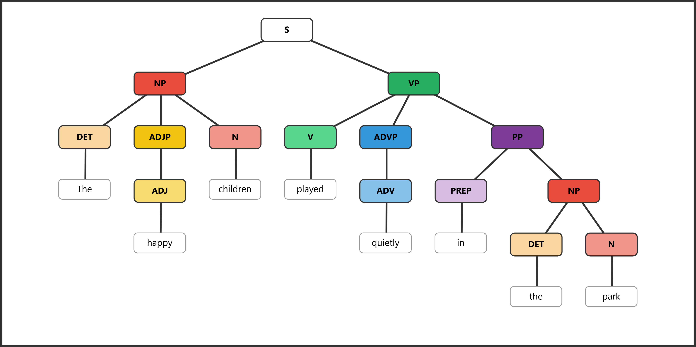
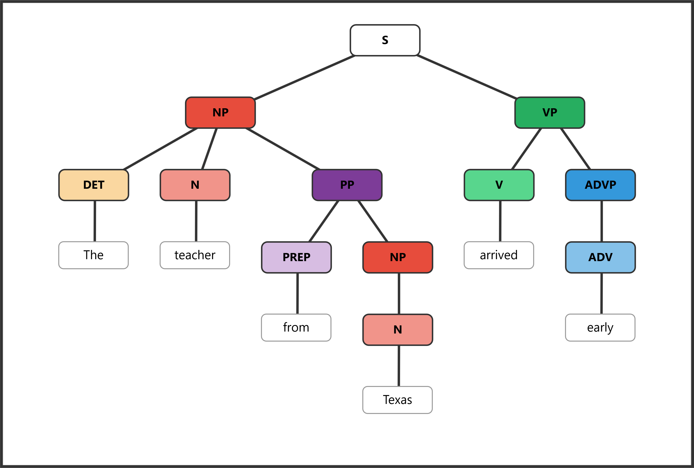
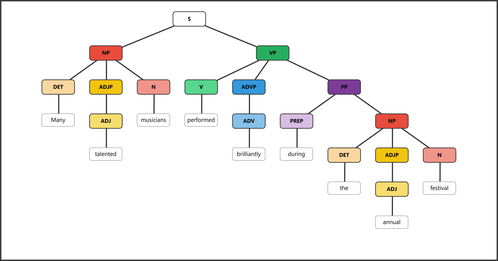

# ENGL 3110 - Exam One Study Guide - Spring 2026 — ANSWER KEY

**This study guide mirrors the format and topics of Exam One. Use it to practice before the exam.**

**Sections:**

- **Section A: Multiple Choice** — 13 questions
- **Section B: Sentence Labeling and Diagramming** — 5 sentences
- **Bonus** — 3 questions

---

## Section A: Multiple Choice

### Section A1: Morphology and Word Structure (Questions 1–4)

**Question 1:** How many morphemes does the word "unbreakable" contain?

> **Answer: c**
>
> a. 1
>
> b. 2
>
> **c. 3** — *un-* (bound) + *break* (free) + *-able* (bound)
>
> d. 4

**Question 2:** Which of the following words contains exactly one morpheme?

> **Answer: b**
>
> a. replay — 2 morphemes: *re-* + *play*
>
> **b. kitchen** — 1 morpheme. It cannot be meaningfully divided into smaller units.
>
> c. untrue — 2 morphemes: *un-* + *true*
>
> d. singer — 2 morphemes: *sing* + *-er*

**Question 3:** Which of the following is a free morpheme?

> **Answer: c**
>
> a. -ly — bound morpheme (cannot stand alone)
>
> b. -ment — bound morpheme (cannot stand alone)
>
> **c. tree** — free morpheme (can stand alone as an independent word)
>
> d. un- — bound morpheme (cannot stand alone)

**Question 4:** Which of the following correctly identifies the morphemes in "prewashing"?

> **Answer: a**
>
> **a. *pre-* (bound) + *wash* (free) + *-ing* (bound)** — Correct. *Pre-* is a bound prefix meaning "before," *wash* is the free base, and *-ing* is a bound suffix.
>
> b. *pre-* (free) + *wash* (free) + *-ing* (bound) — Incorrect. *Pre-* is bound, not free.
>
> c. *prewash* (free) + *-ing* (bound) — Incorrect. *Prewash* can be further divided into *pre-* + *wash*.
>
> d. *pre-* (bound) + *washing* (free) — Incorrect. *Washing* should be divided into *wash* + *-ing*.

---

### Section A2: Open and Closed Classes (Questions 5–8)

**Question 5:** Which of the following word classes is a closed class?

> **Answer: c**
>
> a. Verbs — open class
>
> b. Nouns — open class
>
> **c. Pronouns** — closed class (a fixed, limited set: I, you, he, she, it, we, they, etc.)
>
> d. Adverbs — open class

**Question 6:** In the phrase "a small child in the classroom," which word is the head of the noun phrase?

> **Answer: c**
>
> a. a — determiner (modifier)
>
> b. small — adjective (modifier)
>
> **c. child** — The head noun. It is the essential word that cannot be removed without destroying the phrase.
>
> d. classroom — head of a nested NP inside the PP, but not the head of the main NP.

**Question 7:** In the sentence "The artist displayed his paintings at the gallery," what is the antecedent of "his"?

> **Answer: b**
>
> a. The gallery
>
> **b. The artist** — The pronoun "his" (third person, singular, masculine) refers back to "The artist."
>
> c. paintings
>
> d. his paintings

**Question 8:** Which of the following words is NOT a preposition?

> **Answer: c**
>
> a. under — preposition
>
> b. between — preposition
>
> **c. always** — adverb (modifies verbs and describes frequency; does not introduce a prepositional phrase)
>
> d. beside — preposition

---

### Section A3: Parts of Speech in Context (Questions 9–13)

*Sentence for Questions 9–10: "Many eager volunteers cheerfully organized the annual fundraiser."*

**Question 9:** Which word in the sentence above is a determiner?

> **Answer: b**
>
> a. eager — adjective
>
> **b. Many** — determiner (indicates amount; cannot be modified by "very"; appears before adjectives)
>
> c. cheerfully — adverb
>
> d. annual — adjective

**Question 10:** Which word in the sentence above is an adverb?

> **Answer: c**
>
> a. Many — determiner
>
> b. eager — adjective
>
> **c. cheerfully** — adverb (modifies the verb "organized"; formed with *-ly* from the adjective *cheerful*)
>
> d. fundraiser — noun

**Question 11:** In the sentence "His brother quickly repaired our broken fence," which word is functioning as a verb?

> **Answer: d**
>
> a. His — determiner
>
> b. brother — noun
>
> c. quickly — adverb
>
> **d. repaired** — verb (the main action of the sentence; takes past tense *-ed*)

**Question 12:** In the sentence "Two curious puppies chased the red ball," which word is an adjective?

> **Answer: b**
>
> a. Two — determiner
>
> **b. curious** — adjective (describes a quality of "puppies"; can be modified by "very": *very curious*)
>
> c. chased — verb
>
> d. ball — noun

**Question 13:** In the phrase "the remarkably bright student," what word class does "remarkably" belong to?

> **Answer: b**
>
> a. Adjective
>
> **b. Adverb** — "Remarkably" modifies the adjective "bright," telling us the degree of brightness. Adverbs can modify adjectives.
>
> c. Determiner
>
> d. Noun

---

## Section B: Sentence Labeling and Diagramming

---

**Question 14:** *The dog barked.*

<table>
<tr><th>Role</th><td colspan="2">Subject</td><td colspan="1">Predicate</td></tr>
<tr><th>Phrase</th><td colspan="2">NP</td><td colspan="1">MVP</td></tr>
<tr><th>Word</th><td>The</td><td>dog</td><td>barked</td></tr>
<tr><th>POS</th><td>DET</td><td>N</td><td>V</td></tr>
</table>

Bracket notation: `[S [NP [DET The] [N dog]] [VP [V barked]]]`

---

**Question 15:** *The happy children played quietly in the park.*

<table>
<tr><th>Role</th><td colspan="3">Subject</td><td colspan="5">Predicate</td></tr>
<tr><th>Phrase</th><td colspan="3">NP</td><td colspan="1">MVP</td><td colspan="1">ADVP</td><td colspan="3">PP</td></tr>
<tr><th>Word</th><td>The</td><td>happy</td><td>children</td><td>played</td><td>quietly</td><td>in</td><td>the</td><td>park</td></tr>
<tr><th>POS</th><td>DET</td><td>ADJ</td><td>N</td><td>V</td><td>ADV</td><td>PREP</td><td>DET</td><td>N</td></tr>
</table>

Bracket notation: `[S [NP [DET The] [ADJP [ADJ happy]] [N children]] [VP [V played] [ADVP [ADV quietly]] [PP [PREP in] [NP [DET the] [N park]]]]]`

---

**Question 16:** *The teacher from Texas arrived early.*

<table>
<tr><th>Role</th><td colspan="4">Subject</td><td colspan="2">Predicate</td></tr>
<tr><th>Phrase</th><td colspan="2">NP</td><td colspan="2">PP</td><td colspan="1">MVP</td><td colspan="1">ADVP</td></tr>
<tr><th>Word</th><td>The</td><td>teacher</td><td>from</td><td>Texas</td><td>arrived</td><td>early</td></tr>
<tr><th>POS</th><td>DET</td><td>N</td><td>PREP</td><td>N</td><td>V</td><td>ADV</td></tr>
</table>

Bracket notation: `[S [NP [DET The] [N teacher] [PP [PREP from] [NP [N Texas]]]] [VP [V arrived] [ADVP [ADV early]]]]`

---

**Question 17:** *Many talented musicians performed brilliantly during the annual festival.*

<table>
<tr><th>Role</th><td colspan="3">Subject</td><td colspan="6">Predicate</td></tr>
<tr><th>Phrase</th><td colspan="3">NP</td><td colspan="1">MVP</td><td colspan="1">ADVP</td><td colspan="4">PP</td></tr>
<tr><th>Word</th><td>Many</td><td>talented</td><td>musicians</td><td>performed</td><td>brilliantly</td><td>during</td><td>the</td><td>annual</td><td>festival</td></tr>
<tr><th>POS</th><td>DET</td><td>ADJ</td><td>N</td><td>V</td><td>ADV</td><td>PREP</td><td>DET</td><td>ADJ</td><td>N</td></tr>
</table>

Bracket notation: `[S [NP [DET Many] [ADJP [ADJ talented]] [N musicians]] [VP [V performed] [ADVP [ADV brilliantly]] [PP [PREP during] [NP [DET the] [ADJP [ADJ annual]] [N festival]]]]]`

---

**Question 18:** *The young artist with curly hair painted quite skillfully.*

<table>
<tr><th>Role</th><td colspan="6">Subject</td><td colspan="3">Predicate</td></tr>
<tr><th>Phrase</th><td colspan="3">NP</td><td colspan="3">PP</td><td colspan="1">MVP</td><td colspan="2">ADVP</td></tr>
<tr><th>Word</th><td>The</td><td>young</td><td>artist</td><td>with</td><td>curly</td><td>hair</td><td>painted</td><td>quite</td><td>skillfully</td></tr>
<tr><th>POS</th><td>DET</td><td>ADJ</td><td>N</td><td>PREP</td><td>ADJ</td><td>N</td><td>V</td><td>ADV</td><td>ADV</td></tr>
</table>

Bracket notation: `[S [NP [DET The] [ADJP [ADJ young]] [N artist] [PP [PREP with] [NP [ADJP [ADJ curly]] [N hair]]]] [VP [V painted] [ADVP [ADVP [ADV quite]] [ADV skillfully]]]]`

---

## Bonus

*Answers will vary. Accept any response that correctly demonstrates the required feature.*

**Bonus 1:** Write a word that contains at least three morphemes. List each morpheme and label it as free or bound. (2 pts)

> Example: "disagreeable" — *dis-* (bound) + *agree* (free) + *-able* (bound) = 3 morphemes
>
> Award 1 pt for a valid word with 3+ morphemes and 1 pt for correct labeling.

**Bonus 2:** Write a noun phrase that contains a determiner, an adjective, and a noun. (2 pts)

> Example: "the cheerful dog"
>
> Award 1 pt for including all three elements and 1 pt for correct word class identification (DET + ADJ + N).

**Bonus 3:** Write a sentence containing a prepositional phrase that modifies a noun. Underline or circle the prepositional phrase. (2 pts)

> Example: "The book *on the table* belongs to me."
>
> Award 1 pt for a valid sentence and 1 pt for correctly identifying a PP that modifies a noun (not a verb).

---

### Quick Answer Reference

| Question | Answer | Question | Answer |
|---|---|---|---|
| 1 | c | 8 | c |
| 2 | b | 9 | b |
| 3 | c | 10 | c |
| 4 | a | 11 | d |
| 5 | c | 12 | b |
| 6 | c | 13 | b |
| 7 | b | | |
