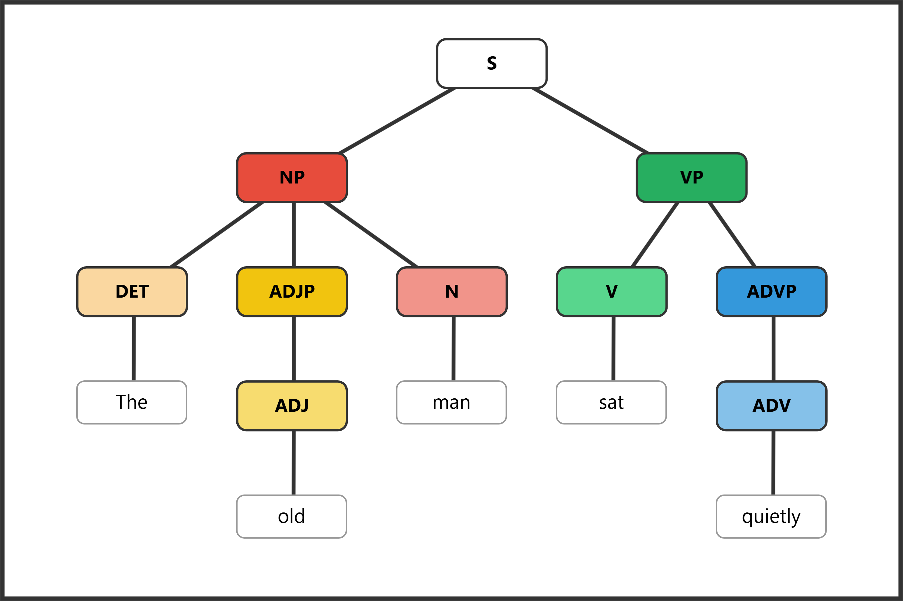

# ENGL 3110 - Exam One - Spring 2026

**Total Points: 100 - Time: 70 Minutes**

**Resources:** Anything except help from other people or AI/LLM (ChatGPT, etc.)

**Sections:**

- **Section A: Multiple Choice** — 50 points (25 questions, 2 points each) — Suggested Time: 30 minutes
- **Section B: Sentence Labeling and Diagramming** — 50 points (5 sentences, 10 points each) — Suggested Time: 30 minutes
- **Bonus** — 10 points (5 questions, 2 points each)

**STUDENT NAME:** \_\_\_\_\_\_\_\_\_\_\_\_\_\_\_\_\_\_\_\_\_\_\_\_\_\_\_\_\_\_\_\_\_\_\_\_\_\_\_\_\_\_\_\_\_\_\_\_\_\_\_\_\_\_\_\_

---

## Section A: Multiple Choice (50 points)

**Instructions:** For each question, select the best answer and write the letter in the blank provided.

---

### Section A1: Morphology and Word Structure (Questions 1–8, 16 points)

**Question 1:** How many morphemes does the word "disagreements" contain? (2 pts)

> Answer: \_\_\_\_\_
>
> a. 1
>
> b. 2
>
> c. 3
>
> d. 4

**Question 2:** Which of the following words contains exactly one morpheme? (2 pts)

> Answer: \_\_\_\_\_
>
> a. unfriendly
>
> b. describe
>
> c. replayable
>
> d. misplace

**Question 3:** Which of the following is a bound morpheme? (2 pts)

> Answer: \_\_\_\_\_
>
> a. book
>
> b. happy
>
> c. -ness
>
> d. walk

**Question 4:** The suffix *-tion* typically creates which word class? (2 pts)

> Answer: \_\_\_\_\_
>
> a. Verb
>
> b. Adjective
>
> c. Noun
>
> d. Adverb

**Question 5:** Which word is an example of a compound (formed from two free morphemes)? (2 pts)

> Answer: \_\_\_\_\_
>
> a. understand
>
> b. carpet
>
> c. bookcase
>
> d. receive

**Question 6:** The word "unhelpful" contains how many morphemes? (2 pts)

> Answer: \_\_\_\_\_
>
> a. 1
>
> b. 2
>
> c. 3
>
> d. 4

**Question 7:** Which of the following correctly identifies the morphemes in "rebuilding"? (2 pts)

> Answer: \_\_\_\_\_
>
> a. *re-* (bound) + *build* (free) + *-ing* (bound)
>
> b. *re-* (free) + *build* (free) + *-ing* (bound)
>
> c. *rebuild* (free) + *-ing* (bound)
>
> d. *re-* (bound) + *building* (free)

**Question 8:** Which word best demonstrates the concept of morphological productivity — the active use of existing morpheme patterns to create new words? (2 pts)

> Answer: \_\_\_\_\_
>
> a. receive
>
> b. podcaster
>
> c. understand
>
> d. carpet

---

### Section A2: Open and Closed Classes (Questions 9–16, 16 points)

**Question 9:** Which of the following word classes is an open class? (2 pts)

> Answer: \_\_\_\_\_
>
> a. Determiners
>
> b. Pronouns
>
> c. Adjectives
>
> d. Prepositions

**Question 10:** Which feature best distinguishes determiners from adjectives? (2 pts)

> Answer: \_\_\_\_\_
>
> a. Determiners appear after the noun
>
> b. Determiners can be modified by "very"
>
> c. Determiners must appear before any adjectives in a noun phrase
>
> d. Determiners describe qualities of the noun

**Question 11:** In the phrase "the tall student from Ohio," which word is the head of the noun phrase? (2 pts)

> Answer: \_\_\_\_\_
>
> a. the
>
> b. tall
>
> c. student
>
> d. Ohio

**Question 12:** Which of the following words is a determiner? (2 pts)

> Answer: \_\_\_\_\_
>
> a. beautiful
>
> b. quickly
>
> c. every
>
> d. student

**Question 13:** In the sentence "The professor entered the room and placed her notes on the desk," what is the antecedent of "her"? (2 pts)

> Answer: \_\_\_\_\_
>
> a. The room
>
> b. The professor
>
> c. The desk
>
> d. her notes

**Question 14:** Pronouns replace which of the following elements? (2 pts)

> Answer: \_\_\_\_\_
>
> a. Only the head noun
>
> b. The entire noun phrase
>
> c. Only the determiner and noun
>
> d. The verb phrase

**Question 15:** Which of the following words is a preposition? (2 pts)

> Answer: \_\_\_\_\_
>
> a. quickly
>
> b. beautiful
>
> c. through
>
> d. they

**Question 16:** Which of the following is NOT a determiner? (2 pts)

> Answer: \_\_\_\_\_
>
> a. the
>
> b. every
>
> c. very
>
> d. some

---

### Section A3: Parts of Speech in Context (Questions 17–25, 18 points)

*Use the following sentence for Questions 17 and 18:*

***Several enthusiastic students quietly studied the challenging material.***

**Question 17:** Which word in the sentence above is a determiner? (2 pts)

> Answer: \_\_\_\_\_
>
> a. enthusiastic
>
> b. Several
>
> c. quietly
>
> d. challenging

**Question 18:** Which word in the sentence above is an adverb? (2 pts)

> Answer: \_\_\_\_\_
>
> a. Several
>
> b. enthusiastic
>
> c. quietly
>
> d. material

**Question 19:** In the sentence "The professor with the briefcase lectured brilliantly," what part of speech is "with"? (2 pts)

> Answer: \_\_\_\_\_
>
> a. Conjunction
>
> b. Determiner
>
> c. Preposition
>
> d. Adverb

**Question 20:** In the sentence "My sister carefully examined their proposal," which word is functioning as a verb? (2 pts)

> Answer: \_\_\_\_\_
>
> a. My
>
> b. sister
>
> c. carefully
>
> d. examined

**Question 21:** In the sentence "Three playful kittens explored the mysterious basement," which word is an adjective? (2 pts)

> Answer: \_\_\_\_\_
>
> a. Three
>
> b. playful
>
> c. explored
>
> d. basement

**Question 22:** In the sentence "She quickly ran to the store," what type of phrase is "to the store"? (2 pts)

> Answer: \_\_\_\_\_
>
> a. Noun phrase
>
> b. Verb phrase
>
> c. Adjective phrase
>
> d. Prepositional phrase

**Question 23:** In the phrase "the extremely tall building," what word class does "extremely" belong to? (2 pts)

> Answer: \_\_\_\_\_
>
> a. Adjective
>
> b. Adverb
>
> c. Determiner
>
> d. Noun

**Question 24:** Which test reliably distinguishes adjectives from determiners? (2 pts)

> Answer: \_\_\_\_\_
>
> a. Adjectives can be pluralized
>
> b. Adjectives can be modified by "very"
>
> c. Adjectives always appear after the noun
>
> d. Adjectives cannot appear before nouns

**Question 25:** According to the basic structure of English sentences, every sentence (S) divides into which two parts? (2 pts)

> Answer: \_\_\_\_\_
>
> a. Determiner + Sentence
>
> b. Noun + Verb
>
> c. Subject NP + Predicate VP
>
> d. Adjective Phrase + Verb Phrase

---

## Section B: Sentence Labeling and Diagramming (50 points)

**Instructions:** For each sentence below, take two steps.

1. **Complete the labeling table** by filling in the Role, Phrase, and Part of Speech (POS) rows.
2. **Write the bracket notation** for the sentence's tree diagram.

**Scoring (per sentence):**

- 4 points — Correct Parts of Speech
- 3 points — Correct Phrase labels
- 1 point — Correct Role labels (Subject, Predicate)
- 2 points — Correct bracket notation

---

**Abbreviation Key**

| **Parts of Speech** | **Phrase Types** | **Roles** |
|---|---|---|
| Noun = N | Noun Phrase = NP | Subject = Subj |
| Verb = V | Verb Phrase = VP | Predicate = Pred |
| Adjective = ADJ | | |
| Adverb = ADV | Adjective Phrase = ADJP | |
| Determiner = DET | Adverb Phrase = ADVP | |
| Preposition = PREP | Prepositional Phrase = PP | |
| | Sentence = S | |

**Notes:**

1. In the Phrase row, label the main verb as **VP** (Verb Phrase). The VP label in the table applies to just the main verb itself.
2. In the Role row, label the subject noun phrase as **Subject** and the verb phrase as **Predicate**. Leave other role cells empty.
3. Always include a phrase level for nouns, verbs, adjectives, adverbs, and prepositions.

---

**Example:** *The old man sat quietly.*

<table>
<tr><th>Role</th><td colspan="3">Subject</td><td colspan="2">Predicate</td></tr>
<tr><th>Phrase</th><td colspan="3">NP</td><td colspan="1">VP</td><td colspan="1">ADVP</td></tr>
<tr><th>Word</th><td>The</td><td>old</td><td>man</td><td>sat</td><td>quietly</td></tr>
<tr><th>POS</th><td>DET</td><td>ADJ</td><td>N</td><td>V</td><td>ADV</td></tr>
</table>

Bracket notation: `[S [NP [DET The] [ADJP [ADJ old]] [N man]] [VP [V sat] [ADVP [ADV quietly]]]]`

---

**Question 26:** (10 pts) *The cat slept.*

| | | | |
|---|---|---|---|
| **Role** | | | |
| **Phrase** | | | |
| **Word** | The | cat | slept |
| **POS** | | | |

Bracket notation: \_\_\_\_\_\_\_\_\_\_\_\_\_\_\_\_\_\_\_\_\_\_\_\_\_\_\_\_\_\_\_\_\_\_\_\_\_\_\_\_\_\_\_\_\_\_\_\_\_\_\_\_\_\_\_\_\_\_\_\_\_\_

---

**Question 27:** (10 pts) *The cheerful birds sang beautifully in the garden.*

| | | | | | | | | |
|---|---|---|---|---|---|---|---|---|
| **Role** | | | | | | | | |
| **Phrase** | | | | | | | | |
| **Word** | The | cheerful | birds | sang | beautifully | in | the | garden |
| **POS** | | | | | | | | |

Bracket notation: \_\_\_\_\_\_\_\_\_\_\_\_\_\_\_\_\_\_\_\_\_\_\_\_\_\_\_\_\_\_\_\_\_\_\_\_\_\_\_\_\_\_\_\_\_\_\_\_\_\_\_\_\_\_\_\_\_\_\_\_\_\_

---

**Question 28:** (10 pts) *The students from Ohio studied carefully.*

| | | | | | | |
|---|---|---|---|---|---|---|
| **Role** | | | | | | |
| **Phrase** | | | | | | |
| **Word** | The | students | from | Ohio | studied | carefully |
| **POS** | | | | | | |

Bracket notation: \_\_\_\_\_\_\_\_\_\_\_\_\_\_\_\_\_\_\_\_\_\_\_\_\_\_\_\_\_\_\_\_\_\_\_\_\_\_\_\_\_\_\_\_\_\_\_\_\_\_\_\_\_\_\_\_\_\_\_\_\_\_

---

**Question 29:** (10 pts) *Several brave firefighters worked tirelessly during the dangerous storm.*

| | | | | | | | | | |
|---|---|---|---|---|---|---|---|---|---|
| **Role** | | | | | | | | | |
| **Phrase** | | | | | | | | | |
| **Word** | Several | brave | firefighters | worked | tirelessly | during | the | dangerous | storm |
| **POS** | | | | | | | | | |

Bracket notation: \_\_\_\_\_\_\_\_\_\_\_\_\_\_\_\_\_\_\_\_\_\_\_\_\_\_\_\_\_\_\_\_\_\_\_\_\_\_\_\_\_\_\_\_\_\_\_\_\_\_\_\_\_\_\_\_\_\_\_\_\_\_

---

**Question 30:** (10 pts) *The tall professor with gray hair spoke very eloquently.*

| | | | | | | | | | |
|---|---|---|---|---|---|---|---|---|---|
| **Role** | | | | | | | | | |
| **Phrase** | | | | | | | | | |
| **Word** | The | tall | professor | with | gray | hair | spoke | very | eloquently |
| **POS** | | | | | | | | | |

Bracket notation: \_\_\_\_\_\_\_\_\_\_\_\_\_\_\_\_\_\_\_\_\_\_\_\_\_\_\_\_\_\_\_\_\_\_\_\_\_\_\_\_\_\_\_\_\_\_\_\_\_\_\_\_\_\_\_\_\_\_\_\_\_\_

---

## Bonus (10 points)

**Instructions:** Write original sentences or phrases meeting each requirement below.

**Bonus 1:** Write a sentence containing a compound word (a word formed from two free morphemes). Underline or circle the compound word. (2 pts)

\_\_\_\_\_\_\_\_\_\_\_\_\_\_\_\_\_\_\_\_\_\_\_\_\_\_\_\_\_\_\_\_\_\_\_\_\_\_\_\_\_\_\_\_\_\_\_\_\_\_\_\_\_\_\_\_\_\_\_\_\_\_\_\_\_\_\_\_\_\_\_\_\_\_\_\_\_\_

**Bonus 2:** Write a sentence containing a prepositional phrase that modifies a noun. Underline or circle the prepositional phrase. (2 pts)

\_\_\_\_\_\_\_\_\_\_\_\_\_\_\_\_\_\_\_\_\_\_\_\_\_\_\_\_\_\_\_\_\_\_\_\_\_\_\_\_\_\_\_\_\_\_\_\_\_\_\_\_\_\_\_\_\_\_\_\_\_\_\_\_\_\_\_\_\_\_\_\_\_\_\_\_\_\_

**Bonus 3:** Write a word that contains at least three morphemes. List each morpheme and label it as free or bound. (2 pts)

Word: \_\_\_\_\_\_\_\_\_\_\_\_\_\_\_\_\_\_\_\_\_\_

Morphemes: \_\_\_\_\_\_\_\_\_\_\_\_\_\_\_\_\_\_\_\_\_\_\_\_\_\_\_\_\_\_\_\_\_\_\_\_\_\_\_\_\_\_\_\_\_\_\_\_\_\_\_\_\_\_\_\_\_\_\_\_\_\_\_\_\_\_

**Bonus 4:** Write a noun phrase that contains a determiner, an adjective, and a noun. (2 pts)

\_\_\_\_\_\_\_\_\_\_\_\_\_\_\_\_\_\_\_\_\_\_\_\_\_\_\_\_\_\_\_\_\_\_\_\_\_\_\_\_\_\_\_\_\_\_\_\_\_\_\_\_\_\_\_\_\_\_\_\_\_\_\_\_\_\_\_\_\_\_\_\_\_\_\_\_\_\_

**Bonus 5:** Write a sentence that is structurally ambiguous (has two possible meanings due to different possible structures). Briefly explain the two meanings. (2 pts)

Sentence: \_\_\_\_\_\_\_\_\_\_\_\_\_\_\_\_\_\_\_\_\_\_\_\_\_\_\_\_\_\_\_\_\_\_\_\_\_\_\_\_\_\_\_\_\_\_\_\_\_\_\_\_\_\_\_\_\_\_\_\_\_\_\_\_\_\_\_\_\_\_

Meaning 1: \_\_\_\_\_\_\_\_\_\_\_\_\_\_\_\_\_\_\_\_\_\_\_\_\_\_\_\_\_\_\_\_\_\_\_\_\_\_\_\_\_\_\_\_\_\_\_\_\_\_\_\_\_\_\_\_\_\_\_\_\_\_\_\_\_\_\_\_

Meaning 2: \_\_\_\_\_\_\_\_\_\_\_\_\_\_\_\_\_\_\_\_\_\_\_\_\_\_\_\_\_\_\_\_\_\_\_\_\_\_\_\_\_\_\_\_\_\_\_\_\_\_\_\_\_\_\_\_\_\_\_\_\_\_\_\_\_\_\_\_
