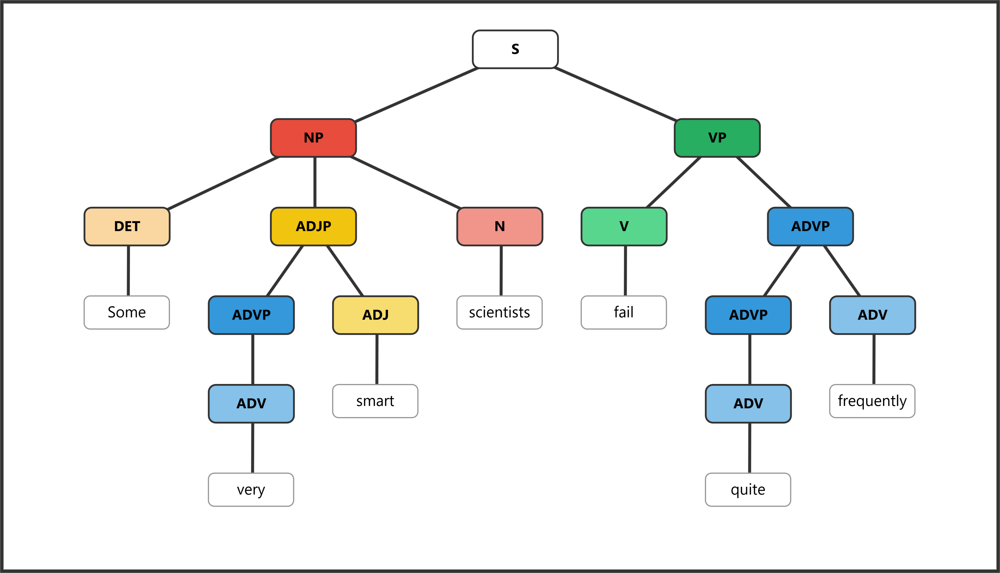
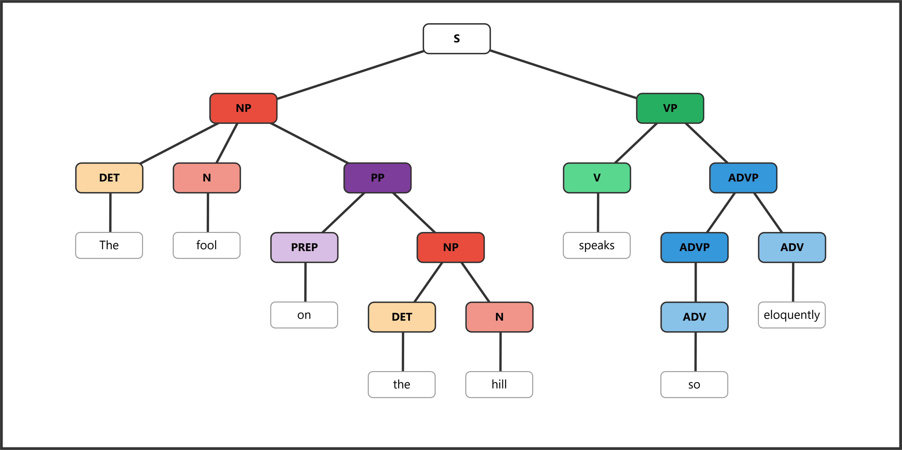
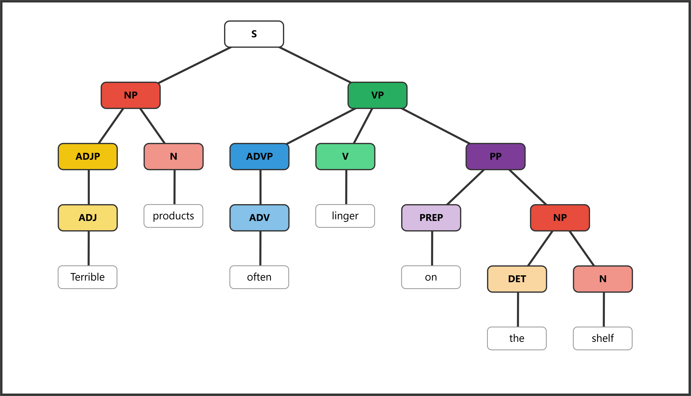
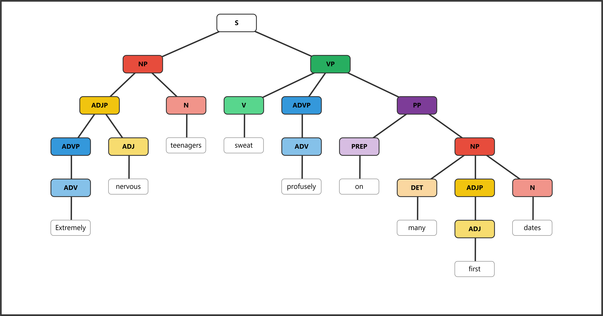

# SyntaxTreeHybrid Practice Assignment — Answer Key

*Instructor use only. Do not distribute to students.*

---

## Exercise 1–4: Sample Sentence Answer Key

These are the New Orleans-themed sample sentences provided in the assignment. Students should create their own sentences, not copy these, but these serve as the model answers for the structural patterns.

### Exercise 1: Simple Sentence

**Sentence:** *Musicians play.*

```
[S [NP [N Musicians]] [VP [V play]]]
```


**Structure breakdown:**

- S → NP + VP
- NP → N (*Musicians*)
- VP → V (*play*)

---

### Exercise 2: Determiner + Adverb

**Sentence:** *The streetcars move slowly.*

```
[S [NP [DET The] [N streetcars]] [VP [V move] [ADVP [ADV slowly]]]]
```


**Structure breakdown:**

- S → NP + VP
- NP → DET (*The*) + N (*streetcars*)
- VP → V (*move*) + ADVP
- ADVP → ADV (*slowly*)

---

### Exercise 3: Adjective Phrase + Prepositional Phrase

**Sentence:** *Delicious gumbo simmers in kitchens.*

```
[S [NP [ADJP [ADJ Delicious]] [N gumbo]] [VP [V simmers] [PP [PREP in] [NP [N kitchens]]]]]
```


**Structure breakdown:**

- S → NP + VP
- NP → ADJP + N (*gumbo*)
- ADJP → ADJ (*Delicious*)
- VP → V (*simmers*) + PP
- PP → PREP (*in*) + NP
- NP → N (*kitchens*)

---

### Exercise 4: Nested Phrases

**Sentence:** *Incredibly lively crowds dance quite energetically.*

```
[S [NP [ADJP [ADVP [ADV Incredibly]] [ADJ lively]] [N crowds]] [VP [V dance] [ADVP [ADVP [ADV quite]] [ADV energetically]]]]
```


**Structure breakdown:**

- S → NP + VP
- NP → ADJP + N (*crowds*)
- ADJP → ADVP + ADJ (*lively*) — the adverb *Incredibly* modifies the adjective
- ADVP → ADV (*Incredibly*)
- VP → V (*dance*) + ADVP
- ADVP → ADVP + ADV (*energetically*) — the adverb *quite* modifies *energetically*
- ADVP (inner) → ADV (*quite*)

---

## Exercise 5: Diagram These Sentences — Answer Key

### 5a. *Some very smart scientists fail quite frequently.*

```
[S [NP [DET Some] [ADJP [ADVP [ADV very]] [ADJ smart]] [N scientists]] [VP [V fail] [ADVP [ADVP [ADV quite]] [ADV frequently]]]]
```



**Structure breakdown:**

- S → NP + VP
- NP → DET (*Some*) + ADJP + N (*scientists*)
- ADJP → ADVP + ADJ (*smart*) — *very* is a degree adverb modifying *smart*
- ADVP → ADV (*very*)
- VP → V (*fail*) + ADVP
- ADVP → ADVP + ADV (*frequently*) — *quite* is a degree adverb modifying *frequently*
- ADVP (inner) → ADV (*quite*)

---

### 5b. *The fool on the hill speaks so eloquently.*

```
[S [NP [DET The] [N fool] [PP [PREP on] [NP [DET the] [N hill]]]] [VP [V speaks] [ADVP [ADVP [ADV so]] [ADV eloquently]]]]
```



**Structure breakdown:**

- S → NP + VP
- NP → DET (*The*) + N (*fool*) + PP — the PP *on the hill* modifies the noun *fool*
- PP → PREP (*on*) + NP
- NP (embedded) → DET (*the*) + N (*hill*)
- VP → V (*speaks*) + ADVP
- ADVP → ADVP + ADV (*eloquently*) — *so* is a degree adverb modifying *eloquently*
- ADVP (inner) → ADV (*so*)

---

### 5c. *Terrible products often linger on the shelf.*

```
[S [NP [ADJP [ADJ Terrible]] [N products]] [VP [ADVP [ADV often]] [V linger] [PP [PREP on] [NP [DET the] [N shelf]]]]]
```



**Structure breakdown:**

- S → NP + VP
- NP → ADJP + N (*products*)
- ADJP → ADJ (*Terrible*)
- VP → ADVP + V (*linger*) + PP — *often* is an adverb modifying the verb, placed before it
- ADVP → ADV (*often*)
- PP → PREP (*on*) + NP
- NP (embedded) → DET (*the*) + N (*shelf*)

---

### 5d. *Extremely nervous teenagers sweat profusely on many first dates.*

```
[S [NP [ADJP [ADVP [ADV Extremely]] [ADJ nervous]] [N teenagers]] [VP [V sweat] [ADVP [ADV profusely]] [PP [PREP on] [NP [DET many] [ADJP [ADJ first]] [N dates]]]]]
```



**Structure breakdown:**

- S → NP + VP
- NP → ADJP + N (*teenagers*)
- ADJP → ADVP + ADJ (*nervous*) — *Extremely* is a degree adverb modifying *nervous*
- ADVP → ADV (*Extremely*)
- VP → V (*sweat*) + ADVP + PP
- ADVP → ADV (*profusely*) — manner adverb modifying *sweat*
- PP → PREP (*on*) + NP
- NP (embedded) → DET (*many*) + ADJP + N (*dates*)
- ADJP → ADJ (*first*)

**Grading note for 5d:** This is the most complex sentence. Key things to look for:

- *Extremely* should be inside an ADVP nested within the ADJP (modifying *nervous*, not *teenagers*)
- *profusely* should be in its own ADVP within the VP
- *many* functions as a determiner (DET), not an adjective
- *first* is an adjective inside an ADJP modifying *dates*
- The PP *on many first dates* attaches to the VP (adverbial), not the NP
