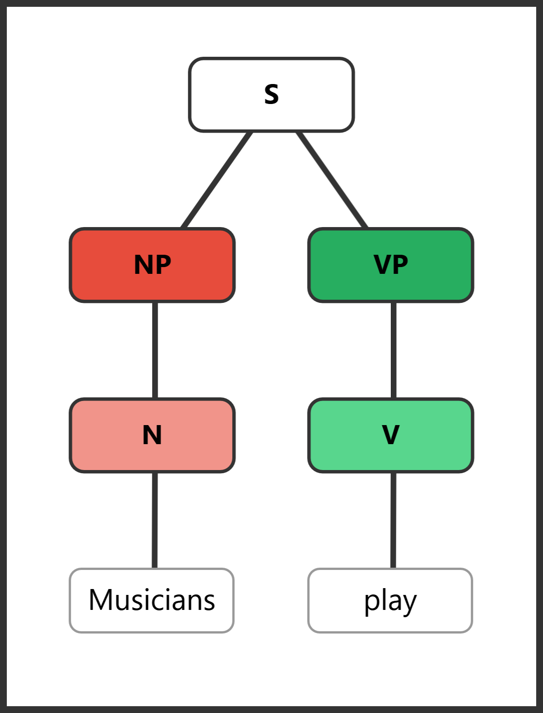
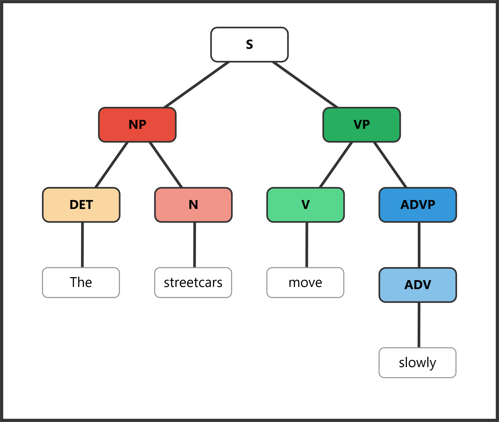
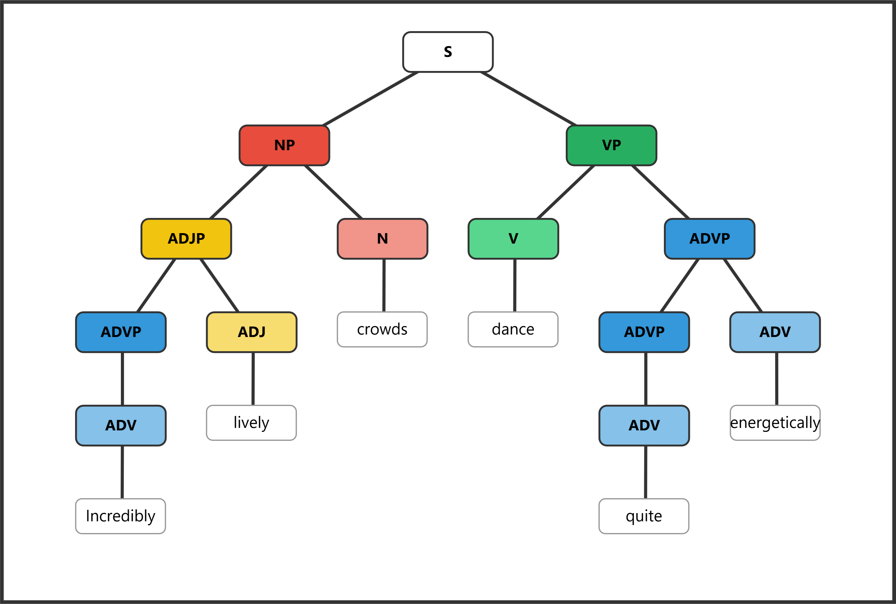

# SyntaxTreeHybrid Practice Assignment

Build a set of diagrams in SyntaxTreeHybrid. For your homework, share both the image of your tree and the bracket notation (copy out of the bracket notation box to the right). Refer to the **SyntaxTreeHybrid Instructions** handout if you need help using the tool.

For each exercise below, **create your own sentence** that includes the required features, then diagram it in SyntaxTreeHybrid. A sample sentence about New Orleans is provided for each exercise to show you what to aim for. **Do not use the sample sentence as your answer** — create your own!

---

## Exercise 1: Simple Sentence

**Required features:**

- a. NP with a Noun
- b. VP with a Verb

**Sample:** *Musicians play.*

```
[S [NP [N Musicians]] [VP [V play]]]
```



Your turn: Create your own simple sentence with just a noun as the subject and a verb as the predicate. Diagram it in SyntaxTreeHybrid and submit both the tree image and bracket notation.

---

## Exercise 2: Adding a Determiner and an Adverb

**Required features:**

- a. NP with a Noun and a Determiner
- b. VP with a Verb and an Adverb

**Sample:** *The streetcars move slowly.*

```
[S [NP [DET The] [N streetcars]] [VP [V move] [ADVP [ADV slowly]]]]
```



Your turn: Create a sentence where the subject NP has a determiner + noun, and the VP has a verb + adverb. Remember that adverbs go inside an ADVP node.

---

## Exercise 3: Adding an Adjective Phrase and a Prepositional Phrase

**Required features:**

- a. NP with a Noun and an ADJP with an Adjective
- b. VP with a Verb and a Prepositional Phrase
    - i. The Prepositional Phrase will have a Prep and an NP with a Noun

**Sample:** *Delicious gumbo simmers in kitchens.*

```
[S [NP [ADJP [ADJ Delicious]] [N gumbo]] [VP [V simmers] [PP [PREP in] [NP [N kitchens]]]]]
```


Your turn: Create a sentence where the subject has an adjective modifying the noun (inside an ADJP), and the predicate includes a prepositional phrase. The PP should contain a preposition and an NP with a noun.

---

## Exercise 4: Nested Phrases

**Required features:**

- a. NP with a Noun and an ADJP
    - i. Include an ADVP with an Adverb inside your ADJP
- b. VP with a Verb and an ADVP
    - i. Include another ADVP inside your top ADVP

**Sample:** *Incredibly lively crowds dance quite energetically.*

```
[S [NP [ADJP [ADVP [ADV Incredibly]] [ADJ lively]] [N crowds]] [VP [V dance] [ADVP [ADVP [ADV quite]] [ADV energetically]]]]
```



Your turn: Create a sentence with nested phrases. The subject's ADJP should contain an adverb modifying the adjective (e.g., *very tall*). The predicate's ADVP should contain an adverb modifying another adverb (e.g., *quite slowly*).

---

## Exercise 5: Diagram These Sentences

Diagram each of the following sentences in SyntaxTreeHybrid. For each one, submit the tree image and the bracket notation.

**a.** *Some very smart scientists fail quite frequently.*

**b.** *The fool on the hill speaks so eloquently.*

**c.** *Terrible products often linger on the shelf.*

**d.** *Extremely nervous teenagers sweat profusely on many first dates.*
